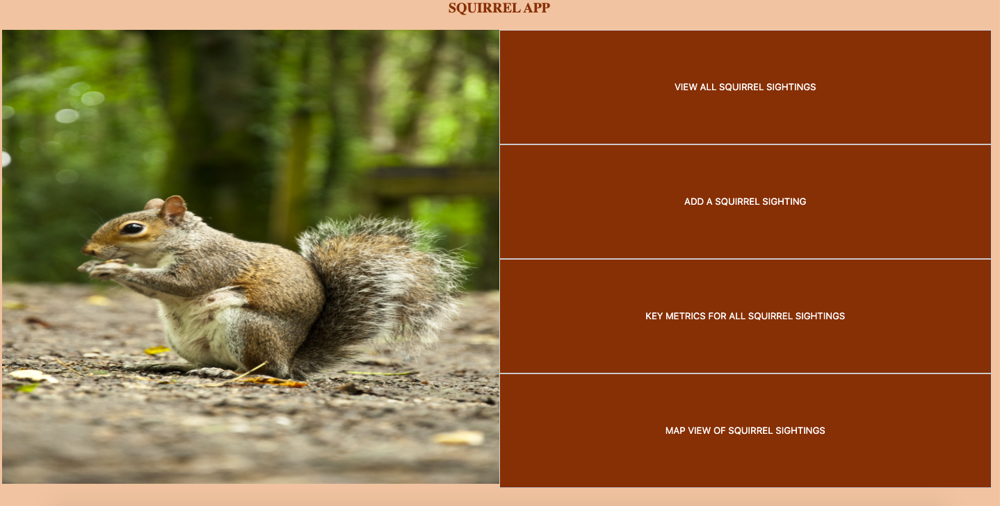
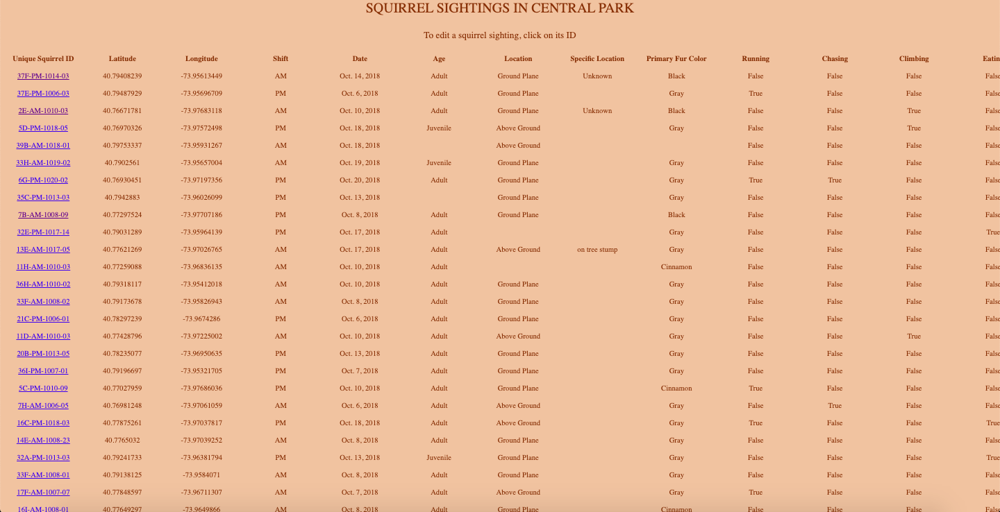
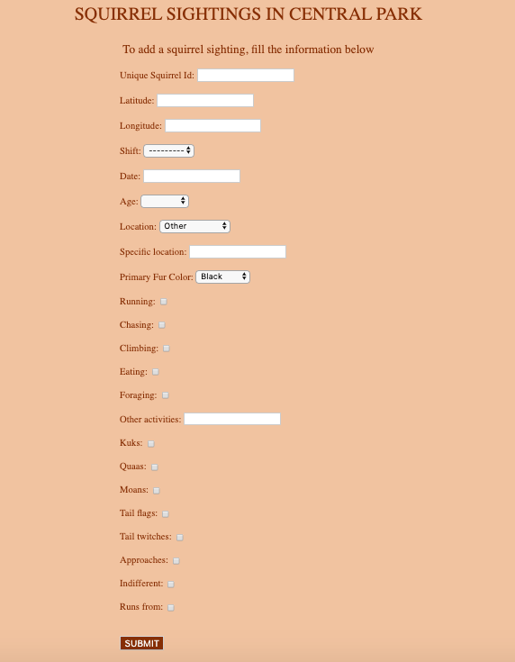
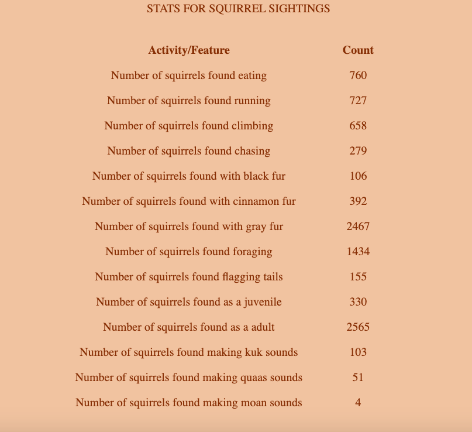
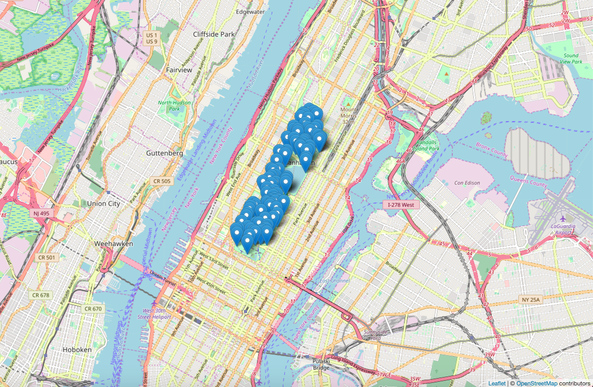

<h1 align="center"> Squirrel-Tracker 

</h1>
<h4 align="center">Squirrel Tracker is a web based application, built with the Django framework, designed to track squirrel sightings in Central Park, New York. The web application imported data from the  <a href="https://data.cityofnewyork.us/Environment/2018-Central-Park-Squirrel-Census-Squirrel-Data/vfnx-vebw">2018 Central Park Squirrel Census</a> and allows a user to add, update, and view squirrel data. 
</h4>

## Project Features:
### Management commands:
    * Import: A command that can be used to import the data from the 2018 census file.
    * Export: A command that can be used to export the data in CSV format.
### Supported fields for the sightings:
    * Latitude
    * Longitude
    * Unique Squirrel ID
    * Shift
    * Date
    * Age
    * Primary Fur Color
    * Location
    * Specific Location
    * Running
    * Chasing
    * Climbing
    * Eating
    * Foraging
    * Other Activities
    * Kuks
    * Quaas
    * Moans
    * Tail flags
    * Tail twitches
    * Approaches
    * Indifferent
    * Runs from

## Web Application Features
- [x] All
    + A view where a user can select between viewing the stats or adding/updating a squirrel sighting
    + Location: */squirrel_sightings/*
- [x] Edit
    + A view to update a particular sighting. 
    + Location: */sightings/unique_squirrel_id/edit*
- [x] Add
    + A view to create a new sighting. 
    + Location: */sightings/add*
- [x] Stats
    + A view with general stats about the sightings.
    + Location: */squirrel_sightings/stats*
- [x] Map
    + A view that shows a map that displays the location of the squirrel sightings on an OpenStreets map
    + Location: */map*
    
## Web Application Demo 
### The main page

### Edit page

### Add page

### Stats page

### Map View page

### Project Group and UNI
    * Project Group 14, Section 1
    * UNI: adj2141, rv2428

